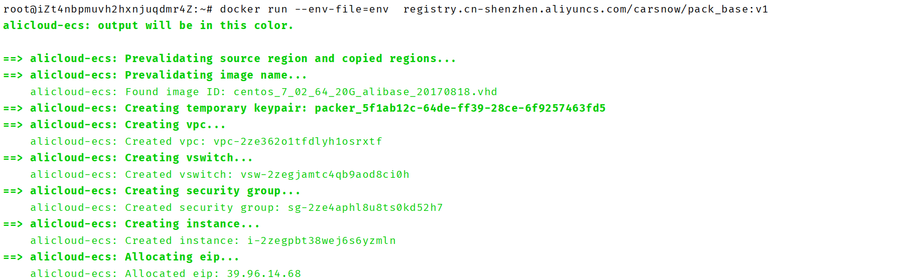

## custom-image-builder使用说明
概览：
>   >custom-image-builder旨在帮助用户在Docker环境中快速构建自己的系统镜像,使用时,用户只需要在一个ENV文件中指定部分系统镜像的信息;例如region等；

使用方法:
```shell script
docker run --env-file=env  registry.cn-shenzhen.aliyuncs.com/carsnow/pack_base:v1
```
---
Tips: --env-file用来指定用户AK信息&&系统镜像的部分信息
```shell script
##env文件
ALICLOUD_ACCESS_KEY=LTAIAHSJSSMWNtr
ALICLOUD_SECRET_KEY=CsgiKHSHSHSHSHSrVl1GBO
REGION=cn-shenzhen
IMAGE_NAME=Base
```
***
执行构建任务时,如下:

***
系统镜像构建完毕，如下:


